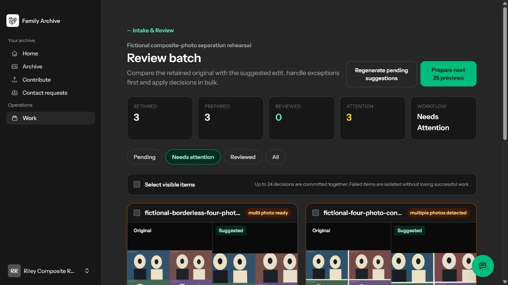
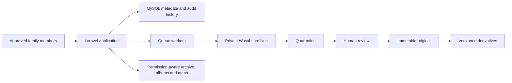

# Family Archive

[](https://github.com/Codie-Shannon/FamilyArchive/actions/workflows/tests.yml)
[](https://github.com/Codie-Shannon/FamilyArchive/actions/workflows/lint.yml)
[](https://github.com/Codie-Shannon/FamilyArchive/releases/latest)

Family Archive is a privacy-first, preservation-grade family history platform.
It protects immutable originals, creates traceable viewing and restoration
derivatives, and gives approved family members a simpler way to contribute,
review and discover shared history.

**Live product:** [familyarchive.bayforgesystems.com](https://familyarchive.bayforgesystems.com)



## Release state

- Current candidate: **v4.1.0 — Clipping-Safe Photo Separation**
- Last closed release: **v4.0.0 — Private Source Exclusion**
- Official evidence: **36 approved and closed screenshot groups**
- Media supported by the completed workflow: **photos**
- Production services: Laravel Cloud, MySQL, Wasabi object storage and Google Maps
- Migration qualification: a synthetic 30,000-entry run proved checkpoints,
  interruption recovery, isolated failures, idempotent replay and reconciliation
- Real family migration: deliberately separate and not represented by public evidence
- Composite scans: automatic border and borderless layout suggestions plus a
  free-form, original-first manual split editor, proven by approved Group 34 evidence
- Split-photo rendering: padded child extraction, independent rotation/deskew and
  final cropping in that order, with manual 90-degree overrides in Group 36
- Private source exclusions: pre-discovery subtree pruning and fail-closed resume
  continuity, proven by approved Group 35 evidence

The v4.1.0 clipping-safe photo-separation release is approved and closed.

## What the product demonstrates

- Immutable, checksum-verified originals with no-overwrite storage boundaries
- Quarantine, duplicate review, human acceptance and append-only audit history
- Automatic and manual restoration from the verified original, with versioned lineage
- Multi-photo scan detection and reversible separation into independently reviewed photos
- Clipping-safe child rendering that rotates or deskews before calculating the final crop
- Resumable batch intake designed for tens of thousands of photos
- Strict source-subtree exclusions whose names and contents never enter discovery
- Delegated family roles, guided non-email access and owner-controlled exceptions
- Albums, permission-aware search and privacy-reviewed interactive maps
- Embedded family messaging with participant-controlled mute, archive and block
- Live production health, restrictive browser headers and private Wasabi storage

The complete feature inventory is in [Capabilities](docs/CAPABILITIES.md). The
architecture and preservation rules are described in the
[System Overview](docs/architecture/SYSTEM_OVERVIEW.md).

## Preservation contract

Accepted originals are never overwritten, silently replaced or automatically
deleted. Quarantine objects, originals and derivatives have separate identities.
Every viewing or restoration derivative records its source lineage. Automated
processing produces suggestions; people make consequential archive decisions.

## Architecture at a glance



The detailed trust boundaries, storage prefixes and processing rules are in the
[System Overview](docs/architecture/SYSTEM_OVERVIEW.md).

## Privacy and evidence

The repository, tests and public screenshot evidence use synthetic people,
places and media. Real family photos, names, storage identifiers, credentials and
local source paths are excluded. The release verifier checks those boundaries and
validates the official PNG evidence packs.

See [Security](SECURITY.md), [Threat Model](docs/THREAT_MODEL.md) and
[Evidence Guide](docs/screenshot-groups/README.md).

The source is publicly viewable for portfolio and evaluation purposes, but it
is not open source. See [Rights and Licensing](RIGHTS_AND_LICENSING.md).

## Technology

- PHP 8.3+ and Laravel 13
- Livewire 4, Flux, Tailwind CSS and Vite
- MySQL in hosted production
- Pest, Larastan and Laravel Pint
- Wasabi S3-compatible private object storage
- Google Maps for privacy-reviewed public locations

## Run locally

Install and initialize the project:

```bash
composer setup
```

Run the local application services:

```bash
composer dev
```

Run the full engineering and release gate:

```bash
composer test
composer release:verify
```

The portfolio dataset is synthetic. Configure a unique
`PORTFOLIO_DEMO_PASSWORD`, then seed a fresh local database:

```bash
php artisan db:seed --class=PortfolioDemoSeeder
```

`PORTFOLIO_DEMO_MODE=true` makes authenticated demonstration writes fail
closed. Never reuse demonstration credentials or data in production.

## Documentation

- [Documentation index](docs/MASTER.md)
- [Current maintenance boundary](docs/CURRENT_BUCKET.md)
- [Capabilities](docs/CAPABILITIES.md)
- [Release history](docs/RELEASE_HISTORY.md)
- [v4.0.0 release notes](docs/release-notes/v4.0.0.md)
- [Roadmap and closed groups](docs/ROADMAP.md)
- [Build and evidence process](docs/BUILD_AND_EVIDENCE.md)
- [Development process](docs/DEVELOPMENT_PROCESS.md)

Created and developed by **Codie Shannon** under **BayForge Systems**.
